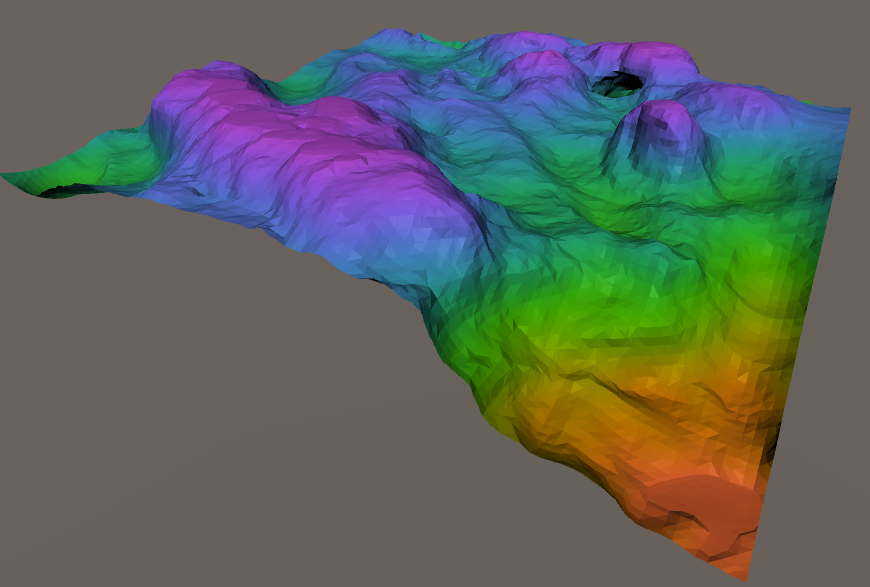
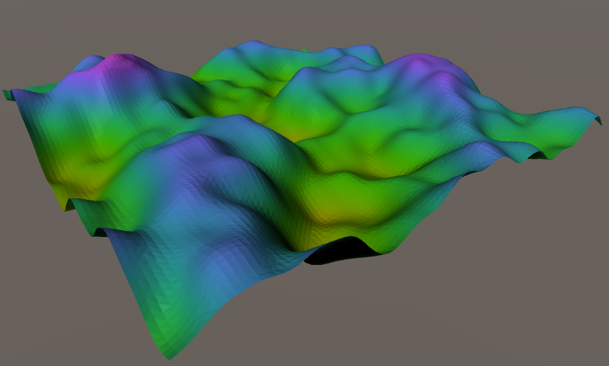
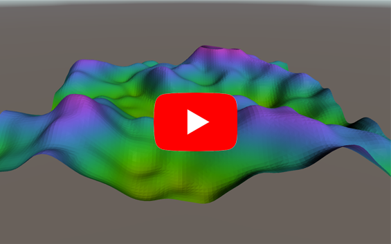

# Generating terrain using Marching Cubes algorithm

## Summary
&nbsp;&nbsp;&nbsp;&nbsp;The goal of this project is to generate different types of terrain (mountains, caves, arches etc.). Using Marching Cubes we achieve efficiency and possibility to create very complex types of terrains. 

*Terrain created from flat surface*

## Marching Cubes
&nbsp;&nbsp;&nbsp;&nbsp;Marching Cubes is an [algorithm](http://paulbourke.net/geometry/polygonise/) for creating a polygonal surface representation of an isosurface of a 3D scalar field. It combines simplicity with high speed since it works almost entirely on lookup tables. First one cube was implemented and tested, after which three different sizes were created. Highest quality - 100x100x50 cubes, moderate quality - 50x50x25 cubes and lowest quality 10x10x5 cubes. Each was used based on selected grid cell size (smaller the size, higher the quality). Smaller grid cell size was tested (200x200x100), but FPS drops to very low and that option was discarded. 

&nbsp;&nbsp;&nbsp;&nbsp;One option is to start creating terrain from flat surface on various levels. Function for flat surface is simple and it contains only the value of that level. Second option is to alter already generated terrain. Terrain generation function was built using sum of four different Perlin Noise functions. Terrain can be altered by adding or removing vertices. Tool has spherical shape and its size can be changed. Adding/removing vertices is achieved by adding or subtracting specific number from vertice number. Only vertices "inside" tool sphere are affected. Specific number is calculated as scaled distance from center of sphere (values of closer vertices are increased/decreased by higher value than ones further away from center).

*Generated terrain using random function*

Video:

